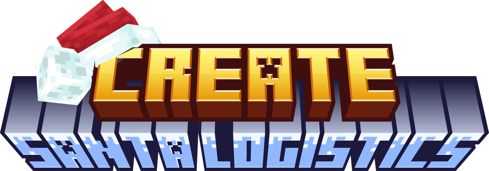

---

## ⚠️ VERY IMPORTANT
This mod introduces a new structure which is unique per world. Due to code limitations, if the mod cannot find a valid place to summon the structure without touching already existing chunks, it won't generate. If you're the world/server owner, execute `/santa try_spawn_santa_base [x] [y] [z]` to manually place it where you prefer. **It is recommended to copy your world before placing the structure**

## Introduction
Santa logistics started as a simple global-packaging idea, as you will discover by pondering the santa-dock, but expanded in a lot more. A santa dock acts like a global frogport, and santa will be the chain conveyor.
Theres a period of 10,000 ticks during the night in which santa will pass by every dock, and deliver/extract packages.
Santa will then come back to his base, and it's your mission to find it, explore it, and unlock a new engine... which is very... explosive